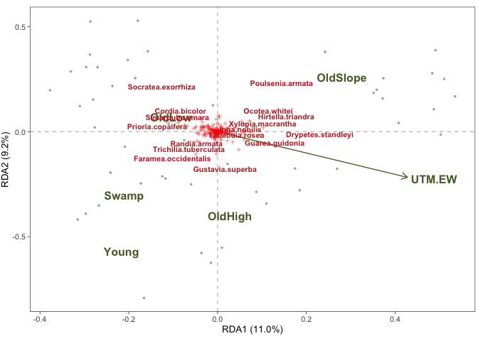

# veganUtils
#### Utility functions and extensions to vegan and ggvegan

While the [**vegan**](https://cran.r-project.org/web/packages/vegan/) package is R's leading multivariate and community ecology tool, producing illustrative graphics to examine differences in species patterns often requires fine-tuning the original graphics. Such fine tuning often requires long piece of code before *vegan*'s `cca` or `rda` results are in a visually examinable format. 

The **veganUtils** package produces **good looking and illustrative ordination graphics for [vegan](https://cran.r-project.org/web/packages/vegan/) with less code**. The package also contains other utility functions and extensions to improve the output of *vegan* objects together with tools to graphically examine nonlinear relationships in multivariate data. Further, many plotting functions in *veganUtils* are implemented using [**ggplot2**](http://ggplot2.tidyverse.org/reference/). The package complements the vegan and [**ggvegan**](https://github.com/gavinsimpson/ggvegan) packages using solutions from these packages whenever possible.

The package is under development and has not been uploaded to CRAN, but *veganUtils* can be installed directly from GitHub


```r
library(devtools)
install_github("MikkoVihtakari/veganUtils")
```

The package is in **an early developmental phase**, and some **functions do not work as intended**. Note that the package comes with absolutely no warranty. Always check the ordination graphics returned by **veganUtils** using the vanilla **vegan** plots. Any bug reports and code fixes are warmly welcomed. Borrowing code from the package to improve *vegan* and associated packages is encouraged. See *Contributions and contact information* for further details.

## Usage

The intention here is not to give instructions for scientifically valid multivariate analyses, but rather to illustrate the differences between *vegan* and *veganUtils* graphics. Refer to the [vegan tutorial](http://cc.oulu.fi/~jarioksa/opetus/metodi/vegantutor.pdf) for instructions how to use *vegan* correctly.

The description under is now finished and will be improved.

### Non-constrained ordination

Load datasets and make a principal analysis (`rda`) object:


```r
library(vegan)
library(ggvegan)
library(veganUtils)

data(BCI)
data(BCI.env)

x <- decostand(BCI, method = "hellinger")

mod <- rda(x)
```

Original *vegan* ordination graphics


```r
plot(mod)
```

<!-- -->

*veganUtils* ordination graphics alternative using base graphics


```r
ord_plot(mod)
```

<!-- -->

*veganUtils* ordination graphics alternative using *ggplot2*


```r
ggord_plot(mod)
```

<!-- -->

#### Adding envfit and ordisurf 

The `envfit` and `ordisurf` fits can be added directly using the `ord_plot` function:


```r
ord_plot(mod, env_data = BCI.env, ordisurf_var = "UTM.EW", envfits = c("Habitat", "UTM.EW"))
```

<!-- -->

#### Transform envfit objects to clean data frames

The `envfit_table` function prints a data frame using the *vegan*´s `envfit` function. Useful for quickly assessing linear fit of environmental variables to an ordination.


```r
envfit_table(mod, BCI.env)
```

```
##     Type      Variable   R2     p   PC1   PC2
## 1 Factor       Habitat 0.40 0.001    NA    NA
## 2 Factor        Stream 0.03 0.257    NA    NA
## 3 Factor       Age.cat 0.01 0.825    NA    NA
## 4 Factor       Geology 0.00 1.000    NA    NA
## 5 Vector        UTM.EW 0.85 0.001 -0.08 -1.00
## 6 Vector        EnvHet 0.08 0.135  0.08 -1.00
## 7 Vector        UTM.NS 0.04 0.410  0.42  0.91
## 8 Vector Precipitation 0.00 1.000  0.00  0.00
## 9 Vector     Elevation 0.00 1.000  0.00  0.00
```

The function also contains a feature to clean up variable names


```r
envfit_table(mod, BCI.env, clean_var_names = TRUE)
```

```
##     Type      Variable   R2     p   PC1   PC2
## 1 Factor       Habitat 0.40 0.001    NA    NA
## 2 Factor        Stream 0.03 0.307    NA    NA
## 3 Factor       Age cat 0.01 0.812    NA    NA
## 4 Factor       Geology 0.00 1.000    NA    NA
## 5 Vector        UTM EW 0.85 0.001 -0.08 -1.00
## 6 Vector        EnvHet 0.08 0.134  0.08 -1.00
## 7 Vector        UTM NS 0.04 0.412  0.42  0.91
## 8 Vector Precipitation 0.00 1.000  0.00  0.00
## 9 Vector     Elevation 0.00 1.000  0.00  0.00
```

### Constrained ordination


```r
mod <- rda(x ~ Habitat + UTM.EW, BCI.env)
```

Original *vegan* constrained correspondance analysis ordination graphics


```r
plot(mod)
```

<!-- -->

*veganUtils* ordination graphics alternative using base graphics. Assigning the explanatory data matrix to `env_data` cleans up CCA arrow labels automatically. 


```r
ord_plot(mod, env_data = BCI.env)
```

<!-- -->

*veganUtils* ordination graphics alternative using *ggplot2*


```r
ggord_plot(mod, size_preset = "html")
```

<!-- -->

### `ord_plot` options

### `ggord_plot` options

### Axis contributions


```r
axis_plot(mod, italicize_sp_names = TRUE)
```

<!-- -->

### Examine nonlinear relationships in multivariate data


```r
pattern_plot(mod)
```

<!-- -->


## Contributions and contact information

Any contributions to the package are more than welcome. Please contact the package creator Mikko Vihtakari (<mikko.vihtakari@gmail.com>) to discuss your ideas on improving the package. Borrowing code is encouraged, but please cite the original sources. 

## Dependencies

The **veganUtils** package depends on:

- [vegan][vegan]: veganUtils expands on vegan.
- [ggvegan][ggvegan]: Used to handle vegan objects.
- [ggplot2][ggplot2]: Used for graphics.
- [ggrepel][ggrepel]: Used to repel species labels in `ggord_plot`
- [reshape2][reshape2]: Used to manipulate data.
- [plyr][plyr]: Used to access the `mapvalues`, `revalue` and `round_any` functions.
- gridExtra:
- Hmisc: Used to capitalize first letter in strings. Remove.
- tibble: Used to add columns in between columns in data frames. Remove or make dependancy to `tidyverse`

[vegan]: https://cran.r-project.org/web/packages/vegan/
[ggvegan]: https://github.com/gavinsimpson/ggvegan
[ggplot2]: http://ggplot2.tidyverse.org/reference/
[ggrepel]: https://cran.r-project.org/web/packages/ggrepel/index.html
[reshape2]: https://cran.r-project.org/web/packages/reshape2/index.html
[plyr]: https://cran.r-project.org/web/packages/plyr/index.html
